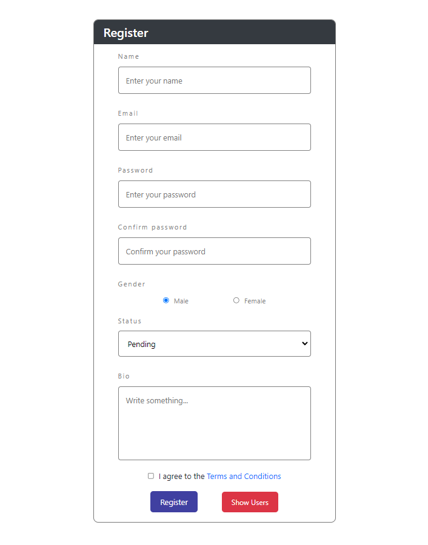
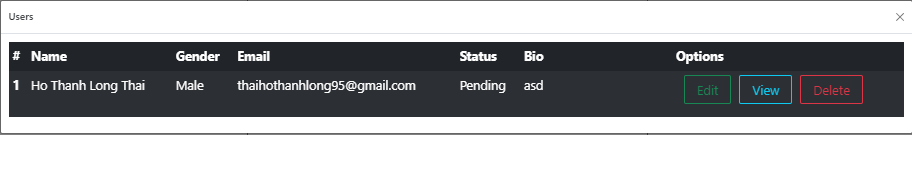

# React Table Users

This project was build by React.\
UI use Reactstrap.

## Available Scripts

In the project directory, you can run:

### `npm start`

Runs the app in the development mode.\
Open [http://localhost:3000](http://localhost:3000) to view it in the browser.

## UI

### Form Register

### Table User

